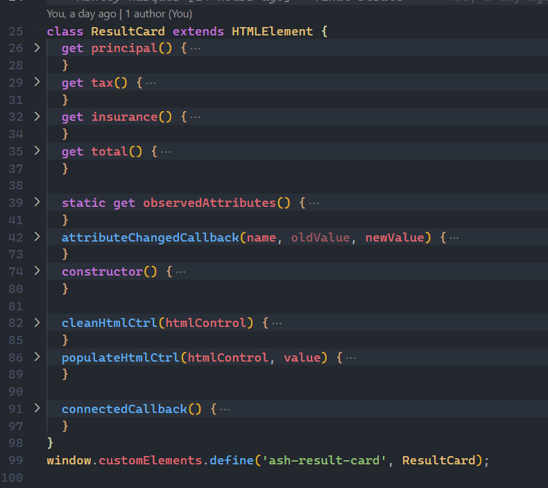
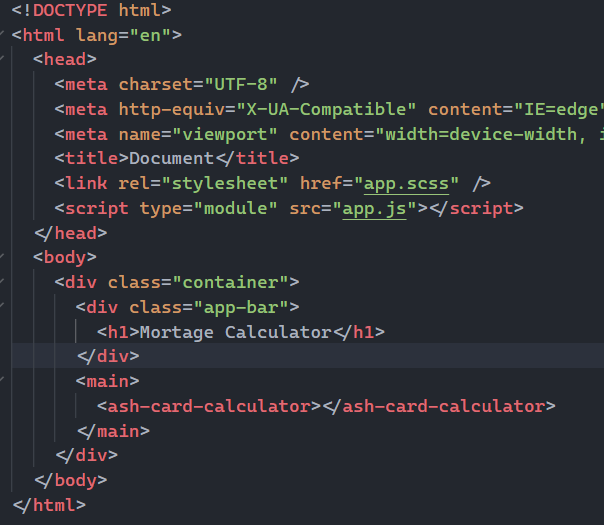

# 📅 Mortagage Calculator 📅

## 👩‍💻 Getting Started

1. Clone this repo and `cd` into it.
1. Restore de packgages with the command: `npm install`♾
1. After download half of the internet, then start the app: `npm run dev` and wait for this message:
   
1. You now can open your browser at `http://localhost:1234/`🚀

### Plain Javascript⁉

1. Custom Elements provide very clean declarations with easy maintanence
   

1. it also provides component base model on html

   
