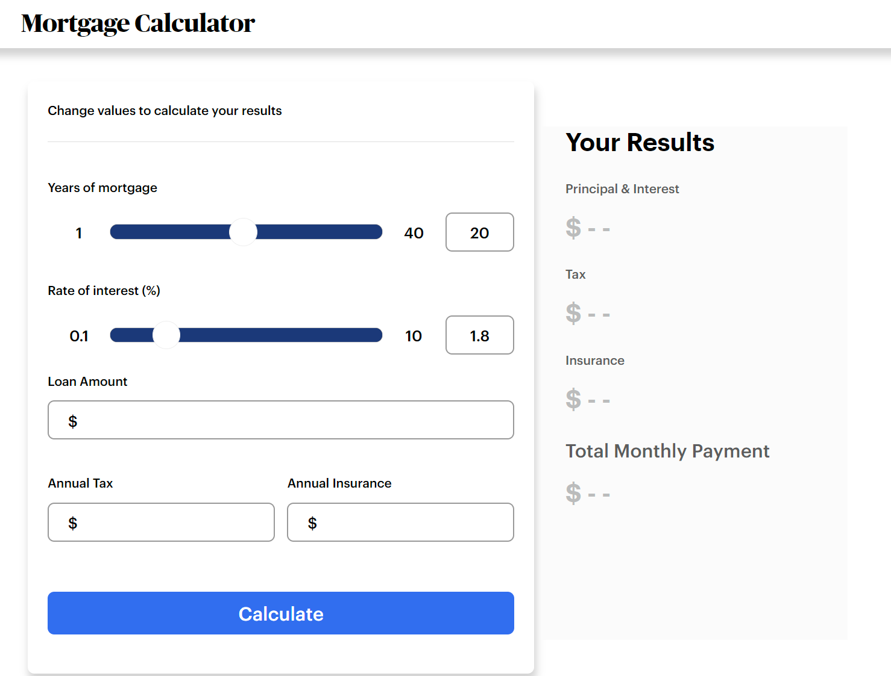
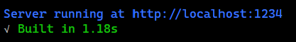
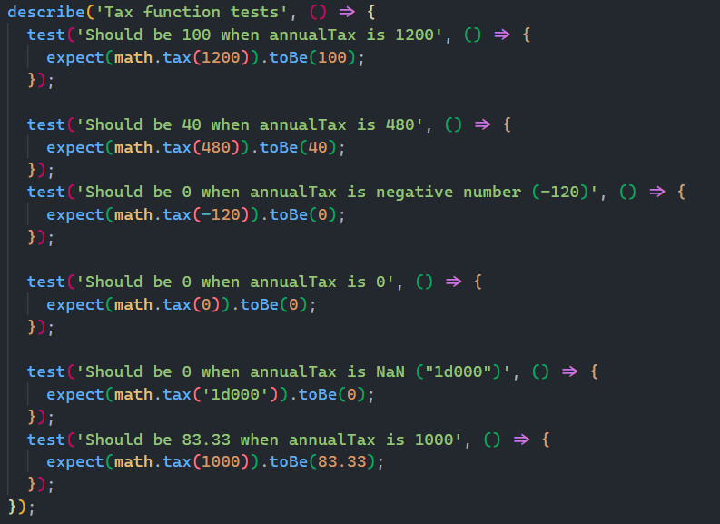
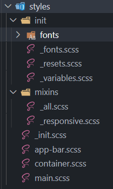

# 📅 Mortgage Calculator 📅

## See it live [here](https://mortgage.marques.top)



## ⚡ Objective

Implement a simple and responsive Mortgage calculator using ES6 features and Sass with no frameworks.

## 👩‍💻 Getting Started

1. Clone this repo and `cd` into it.
1. Restore de packgages with the command: `npm install`♾
1. After downloading half of the internet start the app with the command: `npm run dev` and wait for this message:
   
1. You now can open your browser at `http://localhost:1234/`🚀
1. You also can run the tests using: `npm run test`

```
 PASS  src/modules/math.test.js
  Tax function tests
    √ Should be 100 when annualTax is 1200
    √ Should be 40 when annualTax is 480
    √ Should be 0 when annualTax is negative number (-120)
    √ Should be 0 when annualTax is 0
    √ Should be 0 when annualTax is NaN ("1d000") (1 ms)
    √ Should be 83.33 when annualTax is 1000
  Insurance function tests
    √ Should be 100 when annualInsurance is 1200
    √ Should be 40 when annualInsurance is 480
    √ Should be 0 when annualInsurance is negative number (-120)
    √ Should be 0 when annualInsurance is 0
    √ Should be 0 when annualInsurance is NaN ("1d000")
    √ Should be 25.0 when annualInsurance is 300 (1 ms)
    √ Should be 8.33 when annualInsurance is 100
  Principle & Interest tests
    √ Should return 0 when interestRate is NaN (1 ms)
    √ Should return 0 when interestRate is a negative number (2 ms)
    √ Should return 0 when interestRate is equals to 0
    √ Should return 0 when loanAmount is NaN
    √ Should return 0 when loanAmount is a negative number
    √ Should return 0 when loanAmount is equals to 0
    √ Should return 0 when yearsOfMortgage is NaN
    √ Should return 0 when yearsOfMortgage is a negative number
    √ Should return 0 when yearsOfMortgage is equals to 0
    √ Should return 1438.79 when interestRate=1.8 loanAmount=400K yearsOfMortage=30
  Monthly payment
    √ Should be 1547.12 when interestRate=1.8 loanAmount=400K yearsOfMortage=30 annualTax=1000 annualInsurance=300

Test Suites: 1 passed, 1 total
Tests:       24 passed, 24 total
Snapshots:   0 total
Time:        0.204 s, estimated 1 s
Ran all test suites.
```

## 📚 Stack

1. Custom Elements provide very clean declarations with easy maintenance

```js
class CardCalculator extends HTMLElement {
  // Method's bodies were removed for simplicity
  get result() {} //..
  get button() {} //..
  get annualTax() {} //..
  get annualInsurance() {} //..
  get loan() {} //..
  get years() {} //..
  get rate() {} //..

  constructor() {
    super();
    //..
  }

  connectedCallback() {
    //..
  }
}
window.customElements.define('ash-card-calculator', CardCalculator);
```

1. it also provides component base model on html

```html
<!DOCTYPE html>
<html lang="en">
  <head>
    <meta charset="UTF-8" />
    <meta http-equiv="X-UA-Compatible" content="IE=edge" />
    <meta name="viewport" content="width=device-width, initial-scale=1.0" />
    <title>Mortgage Calculator</title>
    <link rel="stylesheet" href="app.scss" />
    <script type="module" src="app.js"></script>
  </head>
  <body>
    <div class="container">
      <div class="app-bar">
        <h1>Mortgage Calculator</h1>
      </div>
      <main>
        <ash-card-calculator></ash-card-calculator>
      </main>
    </div>
  </body>
</html>
```

1. Using [Parcel](https://parceljs.org/) as building tool
1. Unit testing critical functions using Jest:
   
1. Global Sass for all components
   

## 🤔 Why not...

### - using a framework like Angular, React or Vue instead of plain javascript?

It was a requirement not to.

### - using ShadowDom If you are Custom Elements?

I couldn't make work with global stylesheet, and guess what: global stylesheet it was a requirement as well.

### - using a css framework like Bootstrap or Bulma?

It was a requirement not to.

## 🐞 Known Issues

1. Slider
   - The right part (the upper numbers part) of the track should be _greyish_ but is with the same color of lower part (_blue_).
   - on smaller devices it gets hard to move the thumb, to help mitigate that problem the slider's input box can be used instead.
